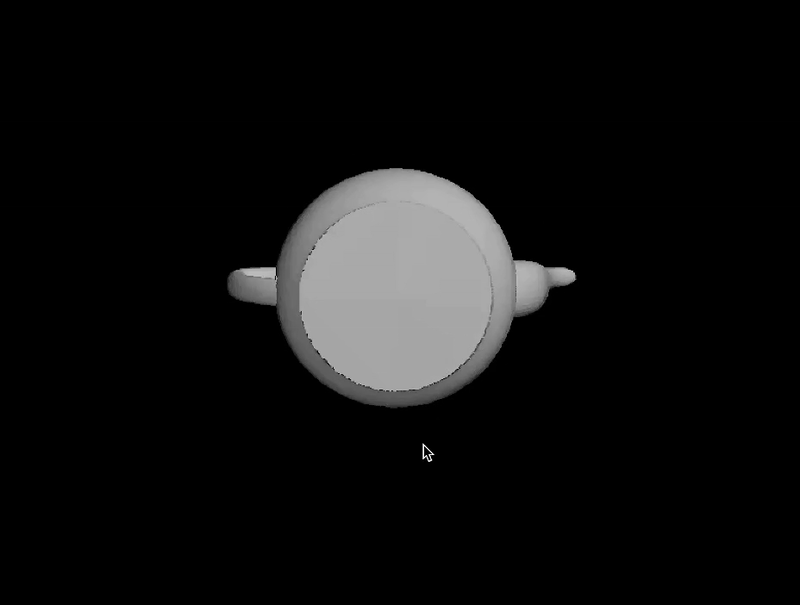
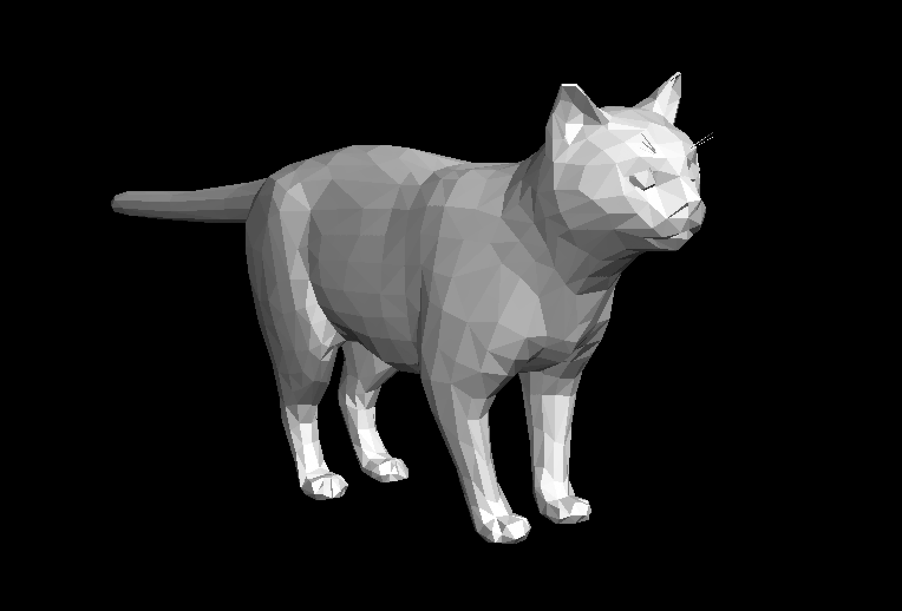

# 3D Renderer From Scratch

This is my second-year course project at HSE. It's a 3D rendering framework developed in C++ to understand and implement key concepts in computer graphics.

# Dependencies
- [GLM](https://github.com/g-truc/glm) [**REQUIRED**] (Used for matrix calculations) 
- [SFML](https://www.sfml-dev.org) [**OPTIONAL**] (Used for model-viewer demo application) 
- [CMake](https://cmake.org)

# Features
- Clipping and Perspective projection
- Tree-like object structure, which allows complex transformations
- Dynamic lighting with colors
- User-friendly interface for interacting with the library

<p align="center">
  
</p>

# Examples

## Donut

(works on Unix systems only)

A recreation of the famous `spinning donut in C`, using this 3D renderer library.

### Build
```bash
mkdir build
cd build
cmake ..
make donut
./donut
```

<p align="center">
  
</p>

## Model Viewer

An application that allows you to inspect any 3D model (.obj file).

Controls:
- `LMB` for camera rotation
- `RMB` for camera movement
- `Mouse wheel` for zooming in/out

### Build
```bash
mkdir build
cd build
cmake ..
make model-viewer
./model-viewer path/to/your/model.obj
```

<p align="center">
  
</p>

# Creating custom 3D scenes
```C++
using namespace engine;

int main() {
    Scene my_scene;
    Renderer my_renderer;
    Reference<EmptyNode> root = my_scene.GetRoot();
    Reference<Camera> camera = root.NewChild(Camera());
    // Add a cube with size = 1
    Reference<Object3D> cube = root.NewChild(Object3D::Cube(1));
    // Add light source as a child of cube
    Reference<LightSource> light = cube.NewChild(engine::LightSource());  
    // Shift light source relatively from cube
    light.SetPosition({-5, 0, 0});             
    light->SetColor(engine::colors::kColorOrange);

    // Get frame with info about pixel colors and z-buffer
    RendererOutput result = 
        my_renderer.Render(my_scene, camera, width, height);
}
```

A full reference with all the features can be found in [docs](/docs/reference.md).

Special thanks to my mentor, Dima, for the insightful reviews and guidance throughout the project.
